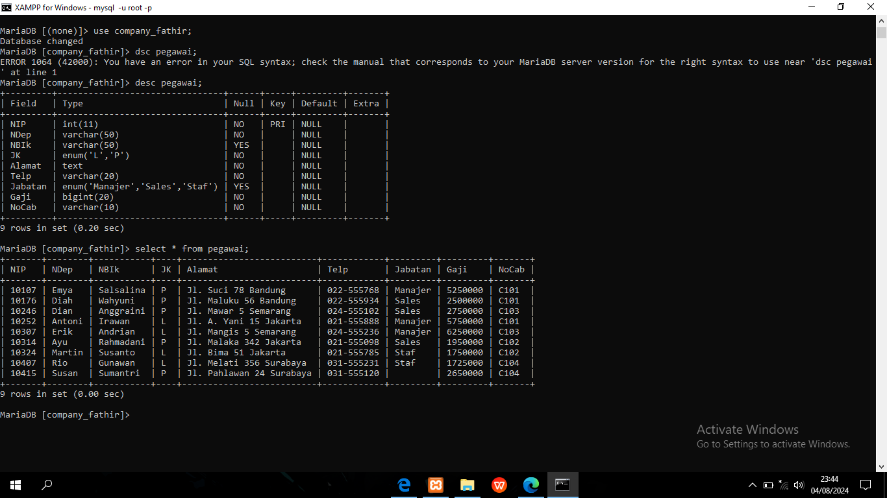
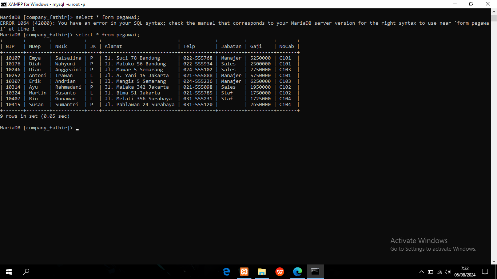

# MEMBUAT DATABASE
1. MEMBUAT DATABASE company_fathir;
    Tujuan dari perintah ini adalah untuk membuat database baru dengan nama company_fathir.
    Sistem akan menambahkan database baru ke server MariaDB setelah eksekusi perintah ini.
   Saat perintah dijalankan dalam gambar, perintah menampilkan pesan "Kueri OK, 1 baris terpengaruh," yang menunjukkan bahwa pembuatan database berhasil.
2. Menampilkan Database; 
    Penjelasan:
    Untuk melihat daftar setiap database di server MariaDB, gunakan perintah ini.
    Perintah ini menghasilkan tabel dengan semua nama database di dalamnya.
    Sepuluh database terlihat di tangkapan layar, termasuk company_fathir yang baru dibentuk

```mysql
CREATE DATABASE "nama_database"
```
**hasil:**
![[BASIS-DATA-XII/asest/create-database.png]]


# CREATE TABLE PEGAWAI
Penjelasan CREATE TABLE pegawai
Perintah CREATE TABLE pegawai digunakan untuk membuat tabel baru bernama pegawai dalam database company_fathir. Berikut adalah penjelasan rinci dari setiap definisi kolom dalam tabel:

primary key NIP int(10)
Jenis: int(10)
Kendala: kunci utama
Penjelasan: Kolom ini bernama NIP, menyimpan nilai bilangan bulat hingga 10 digit, dan ditetapkan sebagai kunci utama tabel. Ini berarti setiap nilai dalam kolom ini harus unik dan bukan null.

Ndep varchar(255) tidak null
Jenis: varchar(255)
constrain: not null
Penjelasan: Kolom ini bernama Ndep, menyimpan string karakter dengan panjang variabel hingga 255 karakter, dan tidak boleh null.

Nblk varchar(255) tidak null
Jenis: varchar(255)
constrain: not null
Penjelasan: Kolom ini bernama Nblk, kolom ini juga menyimpan string karakter dengan panjang variabel hingga 255 karakter, dan tidak boleh null.

JK enum('L','P') not null
Jenis: enum('L','P')
Kendala: not null
Penjelasan: Kolom ini bernama JK, menyimpan salah satu dari dua nilai yang mungkin: 'L' (kemungkinan untuk laki-laki) atau 'P' (kemungkinan untuk perempuan), dan tidak boleh nol.

Teks alamat tidak null
Jenis: teks
Kendala: not null
Penjelasan: Kolom ini bernama Alamat, menyimpan teks dengan panjang variabel, dan tidak boleh null. Biasanya digunakan untuk menyimpan alamat.
Telp varchar(20) tidak null

Jenis: varchar(20)
Kendala: not null
Penjelasan: Kolom ini bernama Telp, menyimpan string karakter dengan panjang variabel hingga 20 karakter, dan tidak boleh null. Biasanya digunakan untuk menyimpan nomor telepon.

Jabatan enum('Manager','Sales','Staf') not null
Jenis: enum('Manajer','Penjualan','Staf')
Kendala: tidak null
Penjelasan: Kolom ini bernama Jabatan, menyimpan salah satu dari tiga nilai yang mungkin: 'Manajer', 'Penjualan', atau 'Staf', dan tidak boleh null. Ini digunakan untuk menentukan posisi pekerjaan karyawan.

Gaji bigint not null
Jenis: bigint
Kendala: tidak null
Penjelasan: Kolom ini bernama Gaji, menyimpan nilai bilangan bulat yang besar, dan tidak boleh null. Ini digunakan untuk menyimpan gaji karyawan.
Nocab varchar(10) tidak null

Jenis: varchar(10)
Kendala: tidak null
Penjelasan: Kolom ini bernama Nocab, menyimpan string karakter dengan panjang variabel hingga 10 karakter, dan tidak boleh null. Ini dapat digunakan untuk menyimpan kode cabang atau kantor.

Pembenaran: Kolom ini disebut Nocab, tidak boleh null, dan menyimpan string karakter dengan panjang bervariasi hingga sepuluh karakter. Ini dapat digunakan untuk menyimpan kode kantor atau cabang.

Penjelasan singakat

Untuk menyimpan data karyawan, pernyataan CREATE TABLE pegawai membuat tabel dengan nama pegawai dan bidang lainnya. Untuk menjamin keakuratan dan legitimasi data, setiap kolom memiliki batasan dan jenis data tertentu. Ini menunjukkan bahwa tindakan pembuatan tabel berhasil diselesaikan dengan pesan "Kueri OK, 0 baris terpengaruh." Ini menunjukkan bahwa meskipun tabel telah dibuat, belum ada data yang ditambahkan.


```mysql
CREATE TABLE pegawai (
value,
dari table pegawai,
);
```

**hasil:**
![[BASIS-DATA-XII/asest/create-table.png]]
# DESC
**Penjelasan** : Dalam MySQL, `DESC` adalah singkatan dari "DESCRIBE". Perintah `DESCRIBE` digunakan untuk menampilkan struktur dari tabel yang ada dalam database. Dengan menggunakan `DESCRIBE`, Anda bisa mendapatkan informasi mengenai kolom-kolom dalam tabel, termasuk nama kolom, tipe data, apakah kolom tersebut dapat bernilai `NULL` atau tidak, dan atribut lainnya seperti kunci primer (primary key) atau default value.

**Contoh :
~~~sql
desc pegawai;
~~~
**Hasilnya :


**Kesimpulan :**

Secara keseluruhan, tabel `pegawai` dirancang dengan kolom `id` sebagai identifikasi unik yang bertambah otomatis, sementara kolom `nama` adalah wajib diisi, dan kolom `jabatan` serta `tanggal_lahir` bersifat opsional. Ini mencerminkan struktur dasar dari tabel yang mungkin digunakan untuk menyimpan data pegawai dengan informasi kunci seperti nama, jabatan, dan tanggal lahir.

# SELECT
**Penjelasan :** Perintah `SELECT` dalam MySQL digunakan untuk mengambil data dari tabel dalam database. Ini adalah perintah dasar dan paling sering digunakan dalam SQL untuk menampilkan data. Anda bisa menggunakan `SELECT` untuk memilih kolom tertentu, menggabungkan tabel, melakukan filter data, dan banyak lagi.

**Contoh :**
~~~sql
select * from pegawai;
~~~

**Hasil :**


**Kesimpulan :**
Perintah `SELECT * FROM pegawai;` berguna untuk melihat seluruh data dalam tabel `pegawai` tanpa batasan atau filter. Ini adalah cara cepat untuk mendapatkan gambaran lengkap tentang data yang ada di tabel, tetapi untuk analisis yang lebih spesifik atau untuk meningkatkan performa query, sebaiknya Anda memilih kolom tertentu dan menerapkan kondisi yang sesuai.